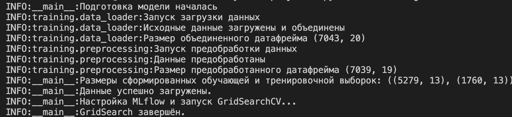
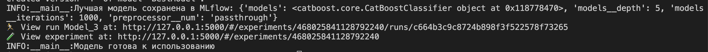
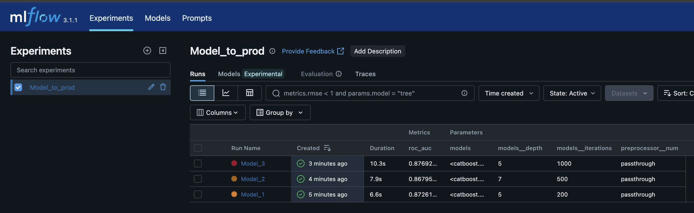
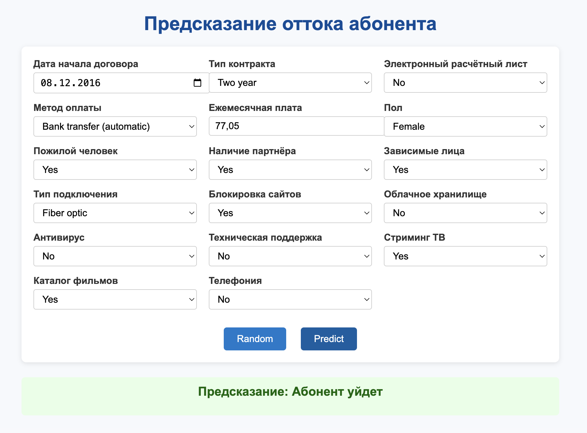
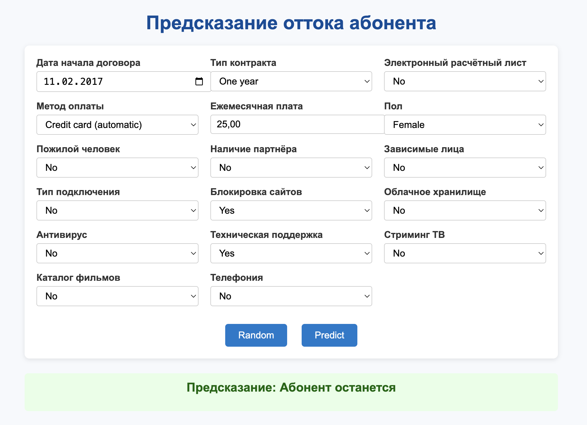
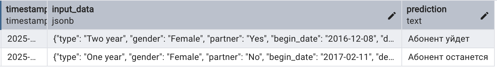

# Прогнозирование оттока клиентов телекоммуникационного оператора

Решение включает:
- Обучение модели на исторических данных.
- MLFlow-трекинг для метрик и моделей.
- Веб-интерфейс на FastAPI для ввода новых данных и получения предсказания.
- Логгирование всех запросов в PostgreSQL.

#### Архитектура проекта

analytical-project/
├── api/
│   ├── main.py
│   ├── predict.py
│   ├── pipeline.py
│   ├── db_utils.py
│   ├── config.py
│   ├── templates/index.html
│   └── models.py
├── training/
│   ├── train.py
│   ├── preprocessing.py
│   └── data_loader.py
├── notebook/customer_retention_analysis.ipynb
├── requirements.txt
├── README.md

#### Как работать с проектом?

##### Создание окружения:

git clone https://github.com/kvl38/analytical-project.git
cd analytical-project
python -m venv .venv
source .venv/bin/activate
pip install -r requirements.txt

##### Обучение модели:

mlflow ui
python -m training.train

Открыть в браузере: http://127.0.0.1:5000

##### Запуск веб-интерфейса:

uvicorn api.main:app --reload
Если возникнут ошибки, используйте альтернативный вариант:
python -m uvicorn api.main:app --reload

Открыть в браузере: http://127.0.0.1:8000

##### Логгирование в PostgreSQL

Все запросы логгируются в базу виде:
- timestamp
- input_data (JSON)
- prediction (TEXT)

#### Технологии

- Python
- FastAPI
- CatBoost
- MLFlow
- PostgreSQL
